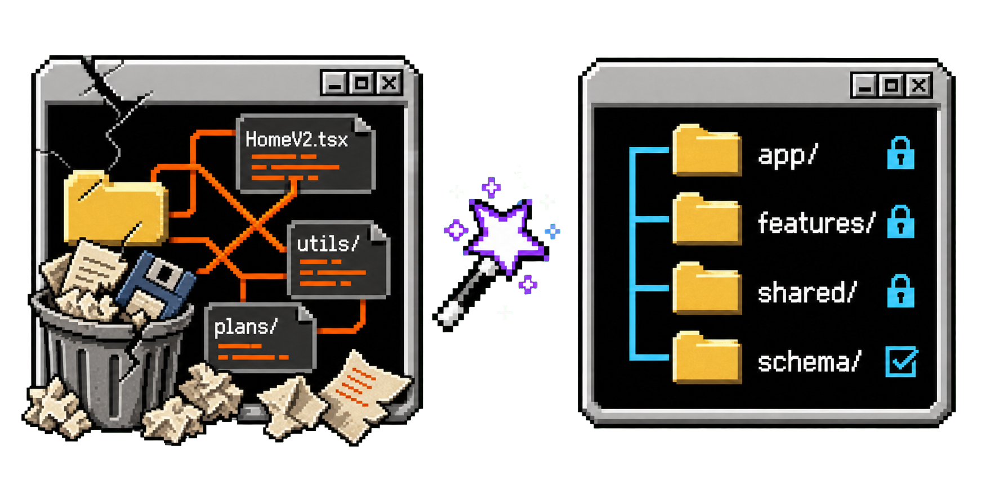

<p align="center">
  
  <h3 align="center">Improve Architecture</h3>
  <p align="center">
    A Codex skill for turning difficult repositories into clear, enforceable codebase architecture.
    <br>
    <p align="center">
      
      
      <a href="https://github.com/e-simpson/improve-architecture"></a>
    </p>
  </p>
</p>

## Install and use

### Install

```text
Install the improve-architecture skill globally:

`bunx skills add e-simpson/improve-architecture --skill improve-architecture --agent codex --global --yes`
```

Prefer bunx, but npx also works. If you do not have Bun, replace `bunx` with `npx`.

### Quick audit

```text
$improve-architecture quick audit
```

### Full audit

```text
$improve-architecture full audit
```

### Implement

```text
Implement the architecture plan.
```

## What it does

`improve-architecture` asks four questions about every part of a repository:

1. Where does this belong?
2. What owns it?
3. Is it still active?
4. What proves the structure stays healthy?

It audits the repository, explains the smallest coherent target model, and produces a staged plan another turn can implement without repeating the investigation.

It is deliberately broader than a folder organizer. It examines:

- root files, source roots, workspaces, packages, and runtime boundaries;
- feature ownership, shared code, schemas, routes, workers, assets, and build tooling;
- dependency direction, cross-feature reach-through, circular ownership, and broad barrels;
- stale `V2`, `New`, `Old`, `Temp`, and compatibility naming;
- dead code, abandoned renderers, empty files, forwarding modules, and duplicate helpers;
- legacy and external code that belongs outside active source paths;
- stale plans, duplicated documentation trees, mystery artifacts, and redundant local config;
- lint and type debt that can be ratcheted into enforceable budgets;
- architectural rules that should become automated structure checks.

## How it thinks

Every recommendation must answer ownership, runtime, real reuse, lifecycle, framework constraints, dependency direction, change coupling, migration cost, enforcement, and reversibility.

The skill then chooses an explicit action:

`keep` · `move` · `rename` · `merge` · `split` · `promote` · `demote` · `archive` · `delete` · `enforce` · `defer`

“Feels cleaner” is not evidence. A move must improve ownership, dependency direction, findability, lifecycle clarity, or enforcement enough to justify its churn.

## What makes it different

- **Architecture before aesthetics.** It does not impose `src/`, feature folders, or any fashionable tree without proving the boundary helps this repository.
- **Framework-aware.** Routes, assets, native projects, plugins, generated files, migrations, and deployment entrypoints may correctly live outside application source.
- **Deletion with proof.** It checks routes, package exports, scripts, config, tests, code generation, dynamic discovery, and Git history before calling code dead.
- **Plans are temporary.** Current truth belongs in code, schemas, configuration, tests, architecture docs, and automated checks—not a cemetery of completed plans.
- **Implementation is staged.** Mechanical path changes, semantic cleanup, residue removal, and verification happen in separate waves.
- **The cleanup stays clean.** Important decisions become dependency rules, structural checks, stale-path searches, and zero-warning budgets.

## Safety

The skill preserves unrelated work, treats dirty worktrees as user-owned, avoids destructive Git recovery, prefers Trash for deletion, and never prints discovered secrets. An audit stops before implementation; the user authorizes the migration in a later message.

## Repository structure

```text
improve-architecture/
├── SKILL.md
└── agents/
    └── openai.yaml
```

## License

MIT — see [LICENSE](LICENSE).
